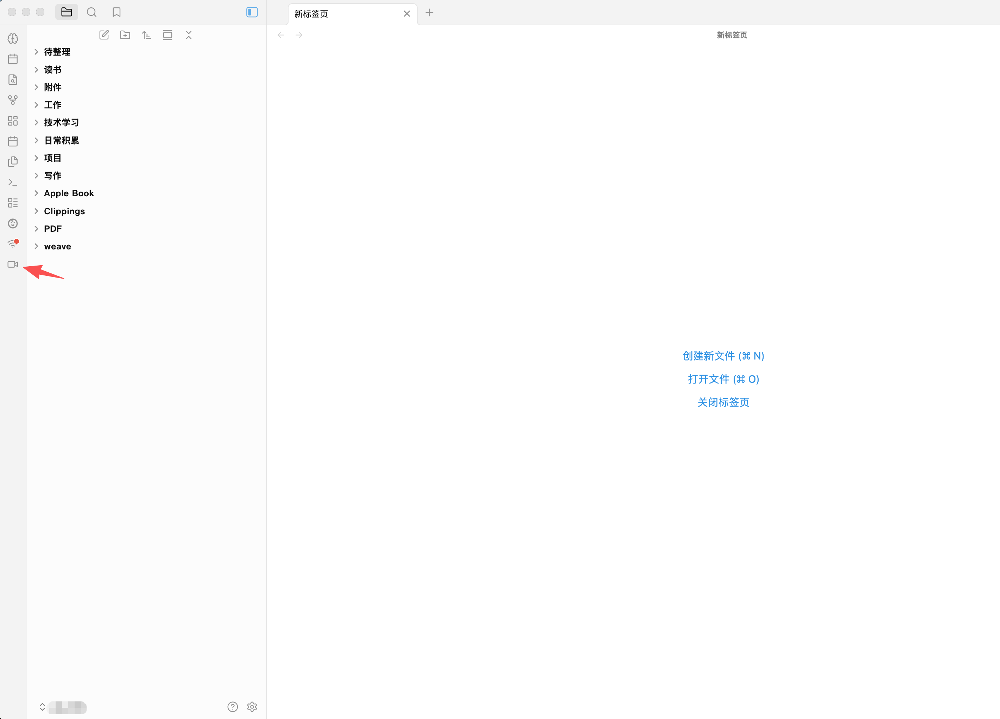
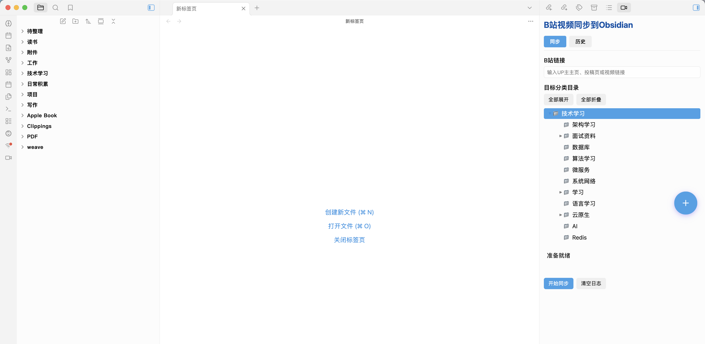
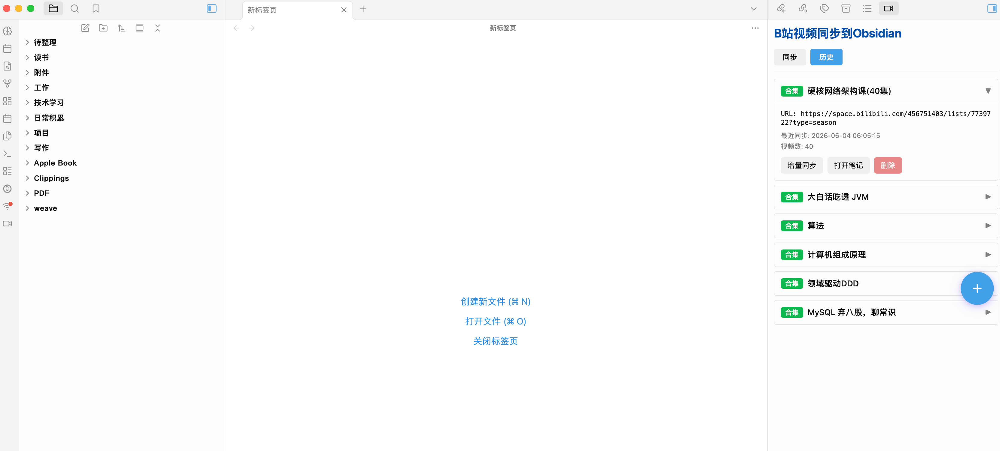
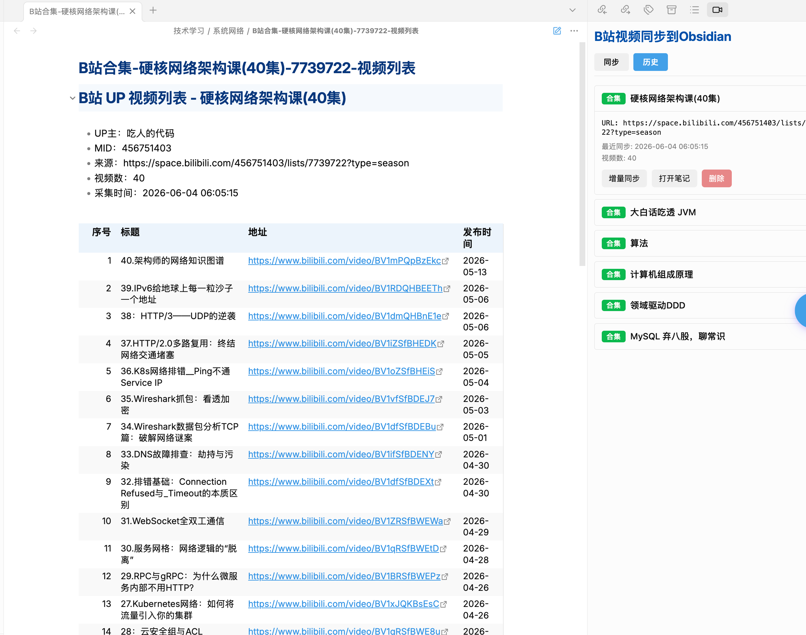
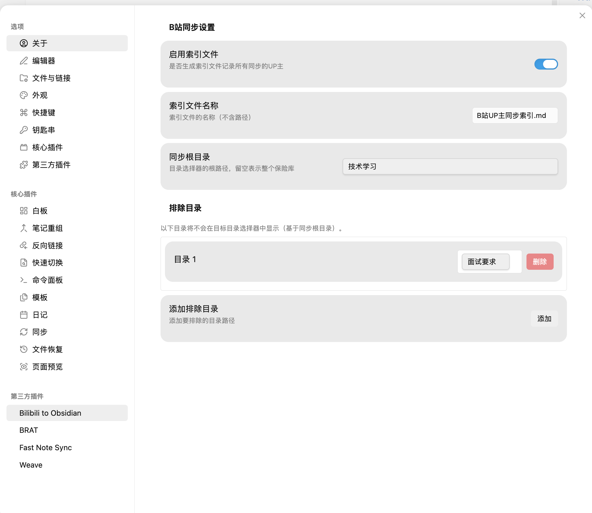
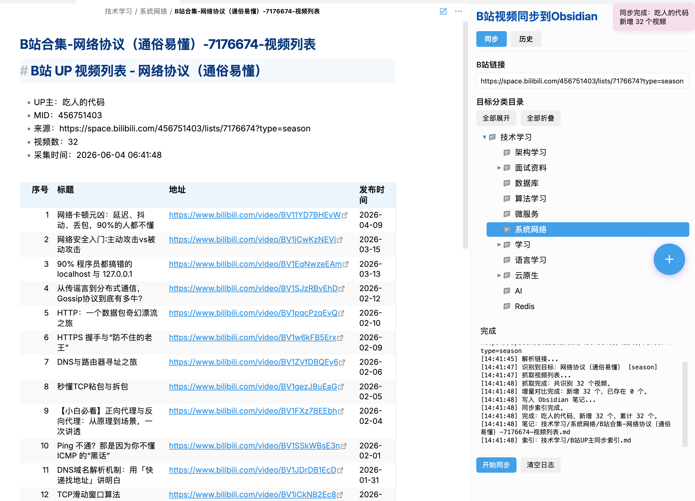

[简体中文](README.md) | [English](README_EN.md)

# Bilibili to Obsidian

将B站UP主、合集、系列的视频列表快速同步到Obsidian笔记。

[](https://github.com/kingfocus31/obsidian-url-sync/releases)
[](LICENSE)

> 快速同步B站视频列表到Obsidian，支持UP主主页、合集、系列等多种链接格式，自动增量更新，历史记录一键重新同步。

如有问题请新建 [Issue](https://github.com/kingfocus31/obsidian-url-sync/issues)

---

## ✨ 插件功能

### 🚀 极简配置
- 粘贴B站链接即可同步，无需繁琐设置
- 支持配置同步根目录，自动创建层级目录结构

### 📗 视频列表同步
- 支持UP主主页、投稿页链接
- 支持合集、系列链接
- 自动抓取视频标题、地址、发布时间
- 增量同步，只新增不重复

### 🌲 树形目录选择
- 可视化选择同步目标目录
- 支持多级目录展开/折叠
- 排除不需要显示的目录

### 📝 历史记录
- 查看所有同步历史
- 一键重新同步，自动回填URL和目标目录
- 支持打开已同步的笔记

### 📑 索引笔记
- 自动生成索引文件，汇总所有同步内容
- 支持自定义索引文件名称

### 🎨 界面交互
- Ribbon图标快速访问
- 左键打开同步面板
- 右键快速进入设置

---

## 📸 截图

### Ribbon图标


### 同步面板


### 历史记录


### 历史详情


### 设置页面


### 同步结果


---

## 🚀 快速开始

### 第一步：获取插件

~~**商店搜索：**~~
~~打开 Obsidian 设置 > 社区插件 > 浏览，搜索 "Bilibili to Obsidian" 进行安装。~~ *(暂未上架)*

**BRAT 插件安装（推荐）：**
1. 先安装 [BRAT](https://github.com/TfTHacker/obsidian42-brat) 插件
2. 打开 BRAT 设置 > Beta Plugin List > Add Beta plugin
3. 输入仓库地址：`https://github.com/kingfocus31/obsidian-url-sync`
4. 点击 Install，等待安装完成
5. 启用插件

**手动下载：**
从 [GitHub 发布页](https://github.com/kingfocus31/obsidian-url-sync/releases) 下载最新版本，将 `main.js`、`styles.css`、`manifest.json` 放入 `.obsidian/plugins/obsidian-bilibili-sync` 文件夹中。

### 第二步：配置插件

1. 打开 Obsidian 设置 > 社区插件
2. 启用 "Bilibili to Obsidian"
3. 点击设置图标，配置以下选项（可选）：
   - **同步根目录**：设置视频列表保存的基础路径（如 `B站视频`）
   - **索引笔记**：是否生成索引文件
   - **排除目录**：在目录选择器中隐藏不需要的文件夹

### 第三步：开始同步

1. 点击左侧边栏的B站图标，打开同步面板
2. 粘贴B站链接（支持以下格式）：
   - UP主主页：`https://space.bilibili.com/xxxxx`
   - 合集链接：`https://space.bilibili.com/xxxxx/lists/xxxxx`
   - 系列链接：`https://space.bilibili.com/xxxxx/channel/seriesdetail?sid=xxxxx`
3. 选择目标分类目录
4. 点击 "开始同步"

---

## 📋 支持的链接格式

| 格式 | 示例 |
| --- | --- |
| UP主主页 | `https://space.bilibili.com/456751403` |
| UP主投稿页 | `https://space.bilibili.com/456751403/video` |
| 合集链接 | `https://space.bilibili.com/456751403/lists/7978502` |
| 系列链接 | `https://space.bilibili.com/456751403/channel/seriesdetail?sid=xxxxx` |

---

## ⚙️ 配置说明

| 配置项 | 说明 | 默认值 |
| --- | --- | --- |
| 同步根目录 | 视频列表保存的基础路径，留空表示整个Vault | 空 |
| 启用索引笔记 | 是否生成索引文件汇总所有同步内容 | 开启 |
| 索引笔记名称 | 索引文件的名称（不含路径） | B站UP主同步索引.md |
| 排除目录 | 在目录选择器中隐藏的目录列表 | 空 |

---

## 📝 生成的笔记格式

同步完成后会生成如下格式的笔记：

```markdown
# B站 UP 视频列表 - [UP主名称]

- UP主：[UP主名称]
- MID：[用户ID]
- 来源：[B站链接]
- 视频数：[视频数量]
- 采集时间：[同步时间]

| 序号 | 标题 | 地址 | 发布时间 |
| --: | --- | --- | --- |
| 1 | 视频标题 | https://bilibili.com/video/xxxxx | 2024-01-01 |
| 2 | ... | ... | ... |
```

---

## 🗺️ 路线图 (Roadmap)

我们正在持续改进，以下是未来的开发计划：

- [ ] **收藏夹同步**：支持同步UP主的收藏夹
- [ ] **稍后再看**：同步稍后再看列表
- [ ] **评论抓取**：抓取视频热门评论
- [ ] **字幕导出**：导出视频字幕内容
- [ ] **封面下载**：自动下载视频封面图
- [ ] **YouTube 支持**：支持同步 YouTube 视频列表
- [ ] **知乎转录**：支持知乎文章一键转录到 Obsidian
- [ ] **小红书转录**：支持小红书文章转录
- [ ] **网页转录**：支持任意网页地址内容的转录

如果您有改进建议或新想法，欢迎通过提交 [Issue](https://github.com/kingfocus31/obsidian-url-sync/issues) 与我们分享——我们会认真评估并采纳合适的建议。

---

## 💖 赞助与支持

如果觉得这个插件很有用，并且想要它继续开发，请在以下方式支持我们，感谢您对开源软件的支持:

| 微信赞赏 |
| :---: |
|  |

---

## 📄 许可证

[MIT License](LICENSE)
